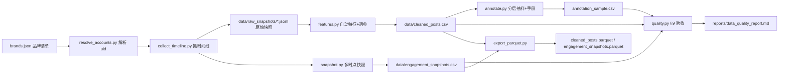

# 微博美妆品牌内容策略研究：项目重构方案

> 本文档是**新主线**的总纲。旧「微博广告帖影响力研究」整体归档（文件保留原位，不再维护）。
> 需求来源：`docs/weibo_data_collection_requirements.md`（用户 2026-09-28 修订版）
> 制定日期：2026-09-29

---

## 一、为什么要重构：差距分析

新需求不是「给旧项目加字段」，而是**研究设计、采集方式、分析口径的全面更换**。

| 维度 | 新需求（美妆品牌内容策略） | 旧方案（广告帖影响力） | 结论 |
|---|---|---|---|
| 研究对象 | 10–15 个**美妆/护肤/个护品牌官方账号** | 6 行业泛广告帖 | 🔴 更换 |
| 抽样方式 | **优先连续抓官方账号时间线**，按品牌×日期×媒体×初始互动分层 | 关键词搜索发现 | 🔴 更换 |
| 样本量 | 1,000–2,500 条；每品牌 ≥50 | 470 条（211 广告帖） | 🔴 扩充 2–5 倍 |
| 时间设计 | 多时点快照 **1h/6h/24h/72h/7d**，主窗口 72h | 仅 T0（54% 零转发） | 🔴 新建机制 |
| 账号类型 | `brand_official` 为主 | 混杂 KOL/媒体/个人 | 🔴 收窄 |
| 人工标注 | 商业意图(单选)+策略(多选)+表达(多选)+可信度风险，**Kappa≥0.60** | 仅 15 条试标，`manual_coding.csv` 为空 | 🔴 新建机制 |
| 自动特征 | 文本/标点/表情/话题/购买引导/折扣/抽奖/新品/明星/功效/场景/时段 + **词典版本号** | 少量手工特征 | 🟡 重做 |
| 主模型 | **负二项**（点赞/评论/转发）+ 品牌 FE/RE + 策略交互 | OLS R² 阶梯（课程作业口径） | 🔴 更换 |
| 预测 | **CatBoost/LightGBM** 预测高转发 + **时间切分** + **消融实验** | 无 | 🔴 新建 |
| 输出物 | `parquet` + 质量报告 + 抽样报告 + 标注手册 | CSV + 论文 docx | 🔴 更换 |
| 合规 | 请求间隔/重试上限/每日上限；不绕验证码；哈希化作者标识 | 部分满足 | 🟡 补强 |

**结论**：旧方案的 `posts.csv / stata_ads*.csv / *.do / 论文*.md` 全部归档，不再作为主线；
其中「m.weibo.cn 接口实测结论」「抽样偏差教训」等**可复用经验**已抽到本方案与新代码中。

---

## 二、修订版研究设计

### 2.1 研究问题
最近一个营销周期内，美妆品牌官方账号的**哪些内容形式与营销策略**更容易获得点赞、评论和转发？
用于**相关性分析与短期预测**，**不声称广告投放的严格因果效果**。

### 2.2 数据范围
- 平台：微博公开页面（`m.weibo.cn` 公开 JSON 接口，默认不带登录态）。
- 账号：10–15 个品牌官方账号，覆盖四类（见 `brands.json`）：
  国产大众 / 国产功效护肤 / 国际大众 / 国际高端。
- 时间：最近 **30–45 天**为分析窗；采集时可放宽到 **60 天**再筛。
- 规模：**1,000–2,500 条**，每品牌 ≥50 条；优先连续抓时间线，不挑热门帖。
- 观察窗口：主 **72h**；补充 1h / 6h / 24h / 7d。

### 2.3 合规边界（硬约束，写进代码）
- 只处理公开可见内容；不采集私信、登录后内容、评论者资料、非必要 PII。
- **不绕过验证码/访问控制/频率限制**；不伪造身份。
- 请求间隔（默认 `--delay 3`）、失败重试上限（默认 3）、每日请求上限（默认 5000）写入 `config.json`。
- 原始正文/图片/链接不公开再分发；作者标识只存**本地不可逆哈希**（`author_hash`）。

### 2.4 变量与字段
严格实现需求 §4 的必采字段、§5 的自动特征、§6 的人工标注字段。字段级对照见 `REQUESTS_TRACE.md`。

### 2.5 抽样与标注
按 **品牌 × 日期(周) × 内容形式 × 初始互动水平** 分层抽样（确保低互动帖也入样，避免只标高互动）。
标注流程：先抽 **200–300 条**双人试标 → 算 **Cohen's Kappa**（商业意图）与逐标签 **F1/Jaccard**（多标签）
→ Kappa<0.60 修订定义、0.60–0.75 记录边界规则、>0.75 扩大标注 → 正式样本 **10%–15%** 双人复核。

### 2.6 模型最低要求（§10）
- 10–15 品牌、1,000–2,500 帖、≥200 条人工试标、≥3 个观察窗口、每个主要策略 ≥30 条样本。
- 负二项回归（点赞/评论/转发三因变量）；品牌固定效应或随机效应；策略交互项。
- CatBoost/LightGBM 预测高转发；**按时间切分**测试集；**加人工标签前后的消融实验**。

---

## 三、新目录结构（`d:\AI\爬虫\beauty_study\`）

```
beauty_study/
├── README.md                      # 使用说明（入口）
├── 项目重构方案.md                 # ← 本文档（主线）
├── REQUESTS_TRACE.md              # 需求条款 → 实现位置 逐条对照
├── config.json                    # 品牌/窗口/限速/每日上限/词典版本
├── brands.json                    # 品牌清单（四类，含候选 uid）
├── code/
│   ├── common.py                  # 路径、日志、CSV/JSONL、哈希、时间解析
│   ├── mweibo.py                  # m.weibo.cn 客户端（会话/头部/限速/重试/每日上限）
│   ├── resolve_accounts.py        # 品牌 → uid 解析（产出候选，人工确认）
│   ├── collect_timeline.py        # 官方账号时间线采集 → 帖子主表
│   ├── snapshot.py                # 多时点互动快照调度（1h/6h/24h/72h/7d）
│   ├── features.py                # 自动特征 + 词典特征（含 dictionary_version）
│   ├── annotate.py                # 分层抽标注样本 / 生成手册 / 算 Kappa
│   ├── quality.py                 # §9 数据质量验收
│   └── export_parquet.py          # CSV/JSONL → parquet
├── data/
│   ├── raw_snapshots/             # 原始 JSON 快照（不公开再分发）
│   ├── cleaned_posts.parquet      # 清洗后帖子
│   ├── engagement_snapshots.parquet
│   ├── annotation_sample.csv
│   └── annotation_guideline.md
└── reports/
    ├── data_quality_report.md
    └── sampling_report.md
```

> 需求 §11 的 `data/... reports/...` 相对路径，在本项目内以 `beauty_study/` 为根；等价关系见 `REQUESTS_TRACE.md`。

---

## 四、数据流



---

## 五、关键复用与新增

### 5.1 复用旧项目的经验（已固化）
- `m.weibo.cn` 接口可用性（避免重复试错）：
  - ✅ 用户资料 `containerid=100505<uid>`；`followers_count` 是字符串（`"931.2万"`），需 `to_int()`。
  - ✅ 主页时间线 `containerid=107603<uid>&page=N`（或 `since_id`），`data.cards[].mblog`，`cardlistInfo.total`。
  - ✅ 帖子详情 `statuses/show?id=<mid>` → `data`（含 `reposts_count/attitudes_count/comments_count/page_info`）。
  - ✅ 评论 `comments/hotflow`。
  - ❌ 转发链不可得（`statuses/reposts` 404）→ 转发链不作字段。
  - ❌ `ip_location` 不存在 → 用 `region_name`。
  - ⚠️ 外链在 `page_info.url_ori`（多为 `t.cn` 短链），不在 `text` 中。
- 工具环境坑：PowerShell `Get-Content` 读无 BOM UTF-8 会乱码；多行命令会被截断 → 逻辑写成 `.py` 文件。
- 长跑必须脱离终端：`Start-Process ... -RedirectStandardOutput` + PID 文件。

### 5.2 新增机制
1. **时间线采集器**（§2「优先连续抓官方账号时间线」）——旧方案没有。
2. **多时点快照调度器**（§8）——旧方案只有 T0。
3. **词典特征 + 版本号**（§5）。
4. **标注工具 + Kappa**（§6–7）。
5. **质量验收脚本**（§9 阈值）。
6. **parquet 导出**（§11）。

---

## 六、风险与对策

| 风险 | 影响 | 对策 |
|---|---|---|
| 公开接口需登录态 | 时间线抓不到 | 客户端支持可选 cookie（`--use-cookie`），默认先试公开；失败再回退 |
| 品牌 uid 解析错 | 抓错账号 | `resolve_accounts.py` 只产出候选，**人工在 brands.json 确认** 后才采集 |
| 每日请求上限/限速 | 被封或超限 | `config.json` 硬上限 + 指数退避 + 中断可续（`since_id` 断点） |
| 72h/7d 快照错过 | 观察窗口缺失 | 调度器按 `published_at` 计算到期时间，容差内重试；错过的窗口标 `missed` 并在模型控制 `post_age_hours` |
| 零互动占比高、右偏 | OLS 不适用 | 主模型用**负二项**；OLS 仅稳健性 |
| 品牌账号数量少、帖子重复内容 | 伪重复 | `is_duplicate`（文本指纹）+ 品牌固定效应 |
| 非美妆内容混入 | 口径污染 | 保留 `exclusion_reason`，质量报告统计 |

---

## 七、交付物与状态

| # | 交付物 | 需求条款 | 状态 |
|---|---|---|---|
| 1 | 需求差距分析 + 修订版项目方案 | — | ✅ 本文档 |
| 2 | 品牌候选清单（四类）+ `brands.json` | §2 | 🔄 进行中 |
| 3 | 项目骨架与配置 | — | ⏳ |
| 4 | `m.weibo.cn` 客户端（限速/重试/cookie） | §3 | ⏳ |
| 5 | 品牌账号解析 + 时间线采集器 | §2 §4.1 §4.2 | ⏳ |
| 6 | 多时点快照调度器 | §8 | ⏳ |
| 7 | 自动特征 + 词典管线 | §5 | ⏳ |
| 8 | 人工标注工具 + Kappa | §6 §7 | ⏳ |
| 9 | 数据质量验收 | §9 | ⏳ |
| 10 | parquet 导出 | §11 | ⏳ |
| — | 建模管线（负二项/品牌FE/CatBoost/时间外预测/消融） | §10 | 🅿️ 待排期（本次未选） |
| — | 论文/报告文档同步 | §11 | 🅿️ 待排期（本次未选） |

---

## 八、旧文件归档说明

旧「广告帖影响力研究」相关文件（`posts.csv`、`stata_ads*.csv`、`*.do`、`论文_*.md/.docx`、
`T0阶段研究报告.md`、`STAGE2_*.md`、`analysis*.do` 等）**保留在 `d:\AI\爬虫\` 原位不动**，
仅标记为「归档，不再维护」。新管线只读写 `beauty_study/` 内部文件，两者互不影响。
如需物理归档到 `archive_ads_study/`，可另行一次性移动（会破坏旧 `.do` 的绝对路径引用，需同步改路径）。
