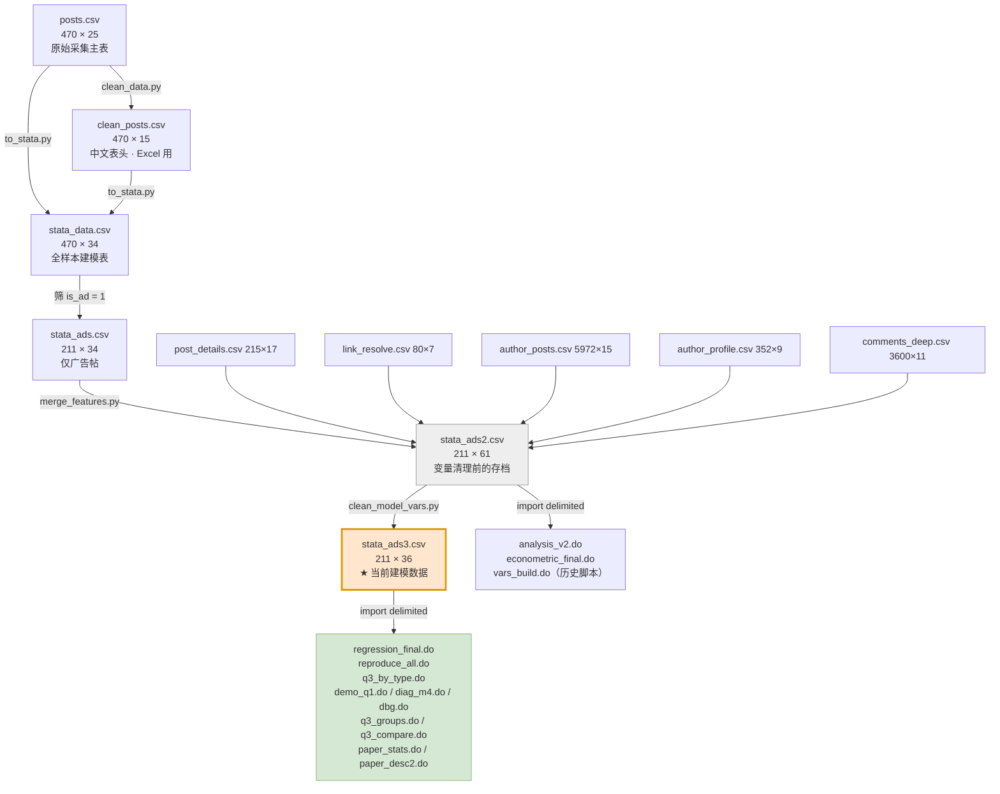

# 建模数据说明：清洗好的建模数据在哪

> 核查日期：2026-09-22
> 核查方式：只读扫描全部 CSV，逐个校验行数/列数/编码/缺失/零方差

---

## 一、直接答案

**你当前建模用的清洗数据是 `stata_ads3.csv`**（2026-09-24 变量清理版）

```
d:\AI\爬虫\stata_ads3.csv
211 行 × 36 列   UTF-8 无 BOM
```

它是 `regression_final.do`、`reproduce_all.do`、`q3_by_type.do` 等 **9 个在用脚本**共同的输入。
所有建模必需变量**全部齐备、无零方差、无 n<5 的稀疏分类层、无事后变量与时间泄漏**。

> 旧的 `stata_ads2.csv`（211 × 61）仍保留在工作区，作为变量清理前的存档；
> 变量的删除/重编码依据、新旧数字对照见 `变量清理说明.md`。

> ⚠️ **Stata 读取时必须 `drop` 后 `gen double` 重算对数变量**：`import delimited` 会把含小数的列
> 存成 float（4 字节），实测会让 SST 差 1.4e-5，而 `recast double` **救不回来**。证据：`check_stata_types.do`。

---

## 二、完整生成链条



**关键脚本**：

| 脚本 | 作用 | 输入 → 输出 |
|---|---|---|
| `clean_data.py` | 生成 Excel 可读的中文表 | `posts.csv` → `clean_posts.csv` |
| `to_stata.py` | 中文列名转 ASCII 变量名，按行号位置对齐两张表 | `posts.csv` + `clean_posts.csv` + `sampling_log.csv` → `stata_data.csv` |
| `merge_features.py` | 合并批次 A/B/C 新变量（帖详情、作者历史、深评论） | `stata_ads.csv` + 5 个辅助表 → `stata_ads2.csv` |
| **`clean_model_vars.py`** | **删冗余/事后变量、重命名、重新量化、重算 `double` 对数变量** | **`stata_ads2.csv` → `stata_ads3.csv`** |
| `verify_clean.py` | 三表行数/表头/位置对齐/派生列校验 | 校验脚本 |
| `check_do_vars.py` | 扫描所有 `.do` 是否仍引用旧变量名 / 旧文件名 | 校验脚本 |
| `check_stata_types.do` | 证明 float 精度陷阱与 `drop`+`gen double` 修法 | 校验脚本 |

---

## 三、四个 Stata 数据表的分工

| 文件 | 行×列 | 编码 | 用途 | 谁在用 |
|---|---|---|---|---|
| `stata_data.csv` | 470 × 34 | UTF-8 无 BOM | **全样本**（含非广告帖），用于广告 vs 非广告对照 | `analysis.do`、`analysis2.do`、`analysis3.do`、`features_check.do` |
| `stata_ads.csv` | 211 × 34 | UTF-8 无 BOM | 仅广告帖的基线版（路线 B 原始口径） | `analysis_ads.do`、`features_check.do`、`diagnose_r2.py` |
| `stata_ads2.csv` | 211 × 61 | UTF-8 无 BOM | 变量清理**前**的存档，可回溯 | `analysis_v2.do`、`econometric_final.do`、`vars_build.do`（历史脚本） |
| **`stata_ads3.csv`** | **211 × 36** | UTF-8 无 BOM | **★ 当前建模主数据**，已删 33 列、重命名 6 列 | 9 个在用脚本（见流程图） |

### `clean_model_vars.py` 在 `stata_ads2` 基础上做了什么

| 操作 | 数量 | 内容 |
|---|---:|---|
| 删除 `is_ad` | 1 | 211 行全为 1，零方差 |
| 删除**事后/同期形成**变量 | 12 | `cmt_total`、`cmt_deep_n`、`aud_fol_med`、`aud_ver_share`（41.2% 缺失，与 DV 同期形成 → 循环论证）及各类计数列 |
| 删除**时间泄漏**变量 | 6 | `hist_avg_lnengage`、`hist_avg_reposts`、`hist_med_reposts`、`hist_n`、`hist_prior_n`、`non_ad_*` |
| 删除 **API 失败填 0** 变量 | 2 | `prof_followers`（93/211 为 0）、`prof_statuses` |
| 删除**冗余/共线**变量 | 8 | `is_hot_topic`、`has_ext_link`、`is_video_link`、`is_lottery_link`、`det_text_len`、`det_pic_num`、`pd_ok`、`source_grp` |
| 删除**稀疏分层**变量 | 2 | `ptype_grp`、`region`（部分层 n<5） |
| 重命名 | 6 | `log_followers→ln_followers`、`log_age_hours→ln_age_hours`、`hist_prior_avg_lnengage→hist_prior_lnengage`、`n_images→n_pics`、`n_mentions→n_mentions_c`、`kw_stratum→kw_grp` |
| 重新量化 | 4 | `n_pics = max(n_images, det_pic_num)`、`ln_followers` 改为真对数、`ln_repost`/`lnf_c`/`lnf_c2` 重算为 `double`、分类变量合并稀疏层 |
| **合计删除** | **33** | 61 + 8（新派生）- 33 = 36 |

> 完整对照表与理由见 `变量清理说明.md`。

### 保留下来的关键变量

| 假设 | 变量（新名） | 备注 |
|---|---|---|
| H1c | **`hist_prior_lnengage`** | 严格早于目标帖发布，**无时间泄漏** |
| H1c | `hist_prior_lnengage0` | 缺失用 0 填充版（与 `has_prior_hist` 配对使用） |
| H2b | **`n_pics`** | 旧 `n_images` 被采集器截断在 9；`n_pics = max(n_images, det_pic_num)` 恢复到 18 |
| H2c | `n_mentions`（原始）+ `n_mentions_c`（分档） | 原始版进主模型；分档版仅做稳健性 |
| 分类 | `kw_grp`（5 层）、`region_grp`（8 层）、`link_grp`（3 层）、`media_type`、`appeal_grp`、`ad_type` | 均已合并稀疏层（每层 n ≥ 10） |

---

## 四、建模变量齐备性校验（实测）

`stata_ads3.csv` 对 `regression_final.do` 所需变量的供给情况：

| 假设 | 变量 | 状态 |
|---|---|---|
| H1a | `ln_followers` | ✅ 211/211 非空，182 个唯一值；真对数（旧 `log_followers` 是 log10） |
| H1b | `is_enterprise`、`is_personal_verified` | ✅ 均 2 值 |
| H1c | `hist_prior_lnengage` / `hist_prior_lnengage0` | ✅ 211/211 非空（41 条用 0 填充 + `has_prior_hist` 标记） |
| H2a | `text_len` / `text_len100` | ✅ 158 个唯一值 |
| H2b | `n_pics`、`media_type` | ✅ 19 值（0–18）/ 4 类 |
| H2c | `n_topics`、`n_mentions` | ✅ 13 值 / 9 值 |
| H3a | `appeal_grp` | ✅ 5 类（新品上新87 / 广告标签49 / 抽奖导流32 / 品牌合作23 / 种草优惠20） |
| H3b/H3c | `n_brand`、`n_promo` | ✅ 3 值 / 5 值 |
| H4a | `is_lottery` | ✅ 2 值（41 / 170） |
| 控制 | `ln_age_hours`、`region_grp`、`pub_hour`、`pub_period`、`is_weekend`、`kw_grp` | ✅ 全部非空 |
| 分组 | `ad_type`（3 类）、`n_pics`/`media_type`（4 类）、`link_grp`（3 类）、`acct`（3 类，由两个认证哑变量生成） | ✅ 每组 n ≥ 20 |
| 聚类/去重 | `author_id`（205 唯一）、`post_id`（211 唯一） | ✅ |

**已不存在零方差变量**（`is_ad` 已删除）。

> ⚠️ 注意：`appeal_grp = 抽奖导流` 与 `is_lottery = 1` 完全重合（41 条），
> 所以分组回归时抽奖组要**去掉 `is_lottery`**，否则 Stata 会报
> `note: 3.appeal_n omitted because of collinearity`（这不是错，但会让系数表难读）。

---

## 五、⚠️ 不要用于建模的数据（同工作区但口径不同）

| 文件 | 行×列 | 为什么不能用 |
|---|---|---|
| `positive_posts_analysis/all_posts_integrated.csv` | 924 × 88 | **7 个关键列整列为空**：`n_topics`、`n_mentions`、`kw_stratum`、`region_grp`、`log_age_hours`、`appeal_grp`、`is_enterprise`。且混入两批不同曝光窗口的数据（29 小时 vs 91 天） |
| `positive_posts_analysis/positive_repost_posts.csv` | 329 × 88 | 同上，且已删除 595 条零转发帖 |
| `stage2_posts.csv` | 454 × 28 | **T0 刚发布快照**，`reposts_t0` 结构性接近 0（零转发 74.4%），与 `posts.csv` 的 91 天累计不可比 |
| `t0_analysis/t0_cleaned_posts.csv` | 454 × 38 | stage2 的清洗版，同上问题 |
| `comments.csv` / `comments_deep.csv` | 2910×8 / 3600×11 | 评论数据，**与转发同期形成，进入解释变量会造成循环论证** |
| `sampling_frame.csv` | 10079 × 19 | 抽样框，不是分析样本 |
| `econometric_results.csv` | 41 × 8 | 结果汇总，不是数据 |

---

## 六、辅助数据表（不直接建模，但生成建模变量用）

| 文件 | 行×列 | 作用 |
|---|---|---|
| `post_details.csv` | 215 × 17 | 批次 A：帖详情（外链/热搜/发布工具）→ 产出 `has_ext_link` 等 |
| `link_resolve.csv` | 80 × 7 | 外链跳转解析 → 产出 `link_grp`、`is_lottery_link` |
| `author_posts.csv` | 5972 × 15 | 批次 B：作者历史帖 → 产出 `hist_prior_avg_lnengage` |
| `author_profile.csv` | 352 × 9 | 批次 B：作者资料 → 产出 `prof_followers`、`prof_statuses` |
| `comments_deep.csv` | 3600 × 11 | 批次 C：深评论 → 产出 `aud_fol_med`、`aud_ver_share` |
| `sampling_log.csv` | 470 × 4 | 采样溯源 → 产出 `kw_stratum` |
| `post_snapshots.csv` | 454 × 15 | 快照（仅 T0，T24H/T7D 缺失） |

---

## 七、缺失文件提示

| 被引用的文件 | 引用者 | 状态 |
|---|---|---|
| `stage2_analysis.csv` | `econometric_stage2.py`、`econometric_stage2.do` | ❌ **不存在**（`build_stage2_data.py` 定义了输出但未生成）→ 这两个脚本目前跑不了 |
| `manual_coding.csv` | 用于计算 Cohen's κ | ⚠️ 存在但 **0 行**（空文件） |

---

## 八、怎么重新生成（如需从原始数据重建）

```powershell
cd d:\AI\爬虫

# 1) 原始 → 中文表 + Stata 全样本表
D:\python\python.exe clean_data.py
D:\python\python.exe to_stata.py          # 生成 stata_data.csv / stata_ads.csv

# 2) 校验对齐（重要：to_stata.py 靠行号位置对齐两表）
D:\python\python.exe verify_clean.py

# 3) 合并批次 A/B/C 新变量
D:\python\python.exe merge_features.py    # 生成 stata_ads2.csv

# 4) 变量清理 → 当前建模主数据
D:\python\python.exe clean_model_vars.py  # 生成 stata_ads3.csv

# 5) 校验建模数据完备性 + 脚本无残留旧变量名
D:\python\python.exe check_model_data.py
D:\python\python.exe check_do_vars.py
```

> ⚠️ **两个不可回退的约束**：
> 1. `to_stata.py` 按**行号位置**对齐 `posts.csv` 与 `clean_posts.csv`（`clean_posts.csv` 里没有 `post_id`）。
>    **绝不能在 Excel 里对 `clean_posts.csv` 排序或删行**，否则静默错位。
> 2. 每一环都**不覆盖**上一环的输出：`merge_features.py` 不动 `stata_ads.csv`，
>    `clean_model_vars.py` 不动 `stata_ads2.csv`。所以任何中间表都可回溯。

---

## 九、一句话总结

| 你想做的事 | 用哪个文件 |
|---|---|
| **跑回归 / 建模**（Stata） | **`stata_ads3.csv`（211 × 36）** |
| 看数据长什么样、手工核对 | `clean_posts.csv`（470 × 15，中文表头，双击 Excel 直接开） |
| 全样本（含非广告帖）分析 | `stata_data.csv`（470 × 34） |
| 只用最基础变量、需要和旧结果对齐 | `stata_ads.csv`（211 × 34） |
| 回溯变量清理前的原始 61 列 | `stata_ads2.csv`（211 × 61） |
| 追溯某个变量怎么来的 | 见第二节的生成链条与第六节辅助表 |

---

## 十、数字口径提示

本文档中所有**模型结果数字**（R²、SSR、系数、F 值）均以 `stata_ads3.csv` 为准，
与 `作业答案_q1q2q3_v2.md`、`作业答案_q3_分类型回归.md`、`回归模型_修订版.md`、
`论文_微博广告帖子影响力研究.md/.docx` 完全一致。

对照表（旧 `stata_ads2` → 新 `stata_ads3`）见 `变量清理说明.md` 第八节。
